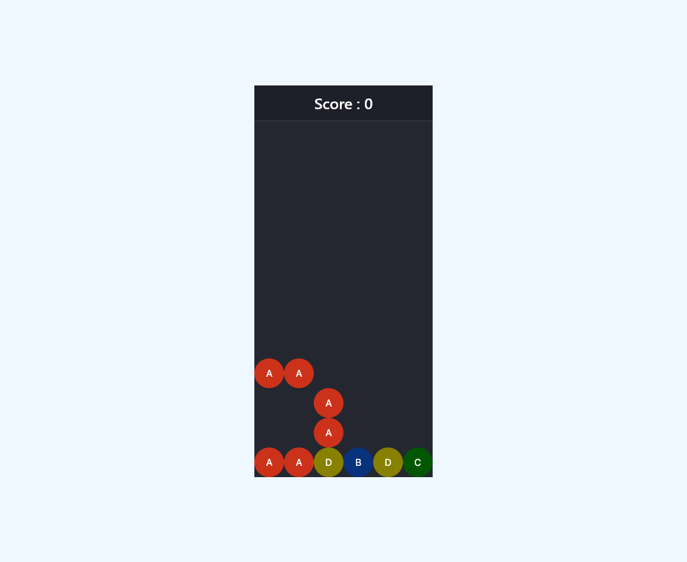

# Puyo Puyo

This is a simple React version of the single-player mode of the game Puyo Puyo (may not be totally complete 😅)

## Install


```bash
   # Clone repository
   git clone https://github.com/ManuelElvir/Puyo-Puyo.git

   # Install dependecies
   npm i

   # Run the project
   npm run dev
```

## How it works

use your mouse wheel to rotate the block in either direction; use the arrow keys to move the block left or right.

Click on the game screen or use the down arrow to bring the block down instantly.

NB : Don't forget to focus on the screen to use the arrow keys

## Demo



